# Robocore-CLI Process Flow

This document describes the complete workflow and architecture of robocore-cli, a tool for building, deploying, and managing containerized ROS2 systems across multiple hosts.

## Overview

Robocore-cli follows a declarative approach where everything is defined in a single `robot.yaml` configuration file. The tool manages the complete lifecycle from development to deployment using Docker containers and multi-host orchestration.

## Process Flow Diagram

```mermaid
graph TB
    %% User Input & Configuration
    User[👤 User] --> Config[📄 robot.yaml<br/>Configuration File]
    Config --> |defines| Components[🧩 Components]
    Config --> |defines| Hosts[🖥️ Hosts]
    Config --> |defines| CommonPkgs[📦 Common Packages]

    %% Development Workflow
    subgraph "Development Workflow"
        direction TB

        %% Init Phase
        Init[🚀 robocore-cli init]
        Init --> InitOutput[📁 Project Structure<br/>- packages/<br/>- common_packages/<br/>- .robocore-cli/<br/>- robot.yaml template]

        %% Prepare Base Phase
        PrepareBase[🏗️ robocore-cli prepare-base]
        PrepareBase --> BaseImage[🐳 Base ROS Image<br/>+ Common Packages]

        %% Stage Phase
        Stage[📦 robocore-cli stage]
        Stage --> |for each component| CompAnalysis[🔍 Component Analysis<br/>- Detect source paths<br/>- Setup managed workspace<br/>- Create symlinks]
        CompAnalysis --> DockerBuild[🏗️ Docker Build<br/>- Generate Dockerfile<br/>- Install dependencies<br/>- Configure DDS]
        DockerBuild --> ComposeGen[📄 Generate docker-compose<br/>Per Host]

        %% Build Phase
        Build[🔨 robocore-cli build]
        Build --> LocalBuild[⚙️ Local Compilation<br/>- Copy source to build/<br/>- Run colcon build<br/>- Generate install/]

        %% Deploy Phase
        Deploy[🚀 robocore-cli deploy]
        Deploy --> Sync[📡 Sync Builds<br/>rsync to remote hosts]
        Sync --> RemoteStart[▶️ Start Containers<br/>docker-compose up]
    end

    %% Component Types
    subgraph "Component Sources"
        direction TB
        LocalSrc[📁 Local ROS Packages<br/>source/sources fields]
        VCSRepo[🌐 VCS Repositories<br/>Git/SVN repos]
        AptPkgs[📦 APT Packages<br/>System dependencies]
        PreBuilt[🐳 Pre-built Images<br/>Existing containers]
    end

    %% Host Architecture
    subgraph "Multi-Host System"
        direction TB
        DevMachine[💻 Development Machine<br/>amd64]
        Robot[🤖 Robot Host<br/>arm64]
        Compute[⚡ Compute Node<br/>GPU/Jetson]

        DevMachine -.->|DDS Discovery| DDSServer[🌐 DDS Discovery Server]
        Robot -.->|DDS Discovery| DDSServer
        Compute -.->|DDS Discovery| DDSServer
    end

    %% Container Orchestration
    subgraph "Container Management"
        direction TB
        DockerRegistry[🗃️ Docker Registry]
        LocalDocker[🐳 Local Docker]
        RemoteDocker[🐳 Remote Docker Hosts<br/>TCP Socket: 2375]

        LocalDocker -->|push| DockerRegistry
        DockerRegistry -->|pull| RemoteDocker
    end

    %% Development Tools
    subgraph "Development Tools"
        direction TB
        Shell[🐚 robocore-cli shell<br/>Interactive development]
        Viz[👁️ robocore-cli viz<br/>RViz, rqt GUI tools]
        Connect[🔗 Remote debugging<br/>SSH into containers]
    end

    %% Connections
    Config --> PrepareBase
    BaseImage --> Stage
    InitOutput --> Stage
    Components --> CompAnalysis
    Hosts --> ComposeGen
    LocalBuild --> Sync
    ComposeGen --> RemoteStart

    %% Multi-host connections
    Components -.->|runs_on| DevMachine
    Components -.->|runs_on| Robot
    Components -.->|runs_on| Compute

    %% Container flow
    DockerBuild --> DockerRegistry
    LocalBuild --> LocalDocker
    RemoteDocker --> RemoteStart

    %% Development tools
    Components --> Shell
    Components --> Viz
    RemoteStart --> Connect

    %% Styling
    classDef userAction fill:#e1f5fe
    classDef buildStep fill:#f3e5f5
    classDef infrastructure fill:#fff3e0
    classDef output fill:#e8f5e8
    classDef tools fill:#fce4ec

    class User,Init,PrepareBase,Stage,Build,Deploy userAction
    class CompAnalysis,DockerBuild,LocalBuild,Sync buildStep
    class DockerRegistry,LocalDocker,RemoteDocker,DDSServer infrastructure
    class BaseImage,ComposeGen,RemoteStart,InitOutput output
    class Shell,Viz,Connect tools
```



## Key Concepts

### 1. Configuration-Driven Architecture
- **Single Source of Truth**: `robot.yaml` defines everything
- **Declarative**: Specify what you want, not how to achieve it
- **Version Controlled**: Configuration lives in your repository

### 2. Component-Based Design
- **Modular**: Each component is an isolated ROS2 workspace
- **Flexible Sources**: Local packages, VCS repos, apt packages, or pre-built images
- **Host Assignment**: Components specify where they run via `runs_on`

### 3. Multi-Stage Build Process
- **Stage**: Prepare containers with dependencies
- **Build**: Compile source code locally in containers
- **Deploy**: Sync builds and launch on target hosts

### 4. Multi-Host Orchestration
- **Architecture Aware**: Cross-compile for different platforms (amd64, arm64)
- **DDS Integration**: Automatic discovery server setup
- **Efficient Sync**: Only changed files are transferred

## Workflow Details

### 1. Project Initialization (`init`)
- Creates project structure with sensible defaults
- Generates `robot.yaml` template with examples
- Sets up managed directories (`.robocore-cli/`)

### 2. Base Preparation (`prepare-base`)
- Creates base ROS image for the specified distribution
- Installs common packages shared across components
- Optimizes build caching and layer reuse

### 3. Staging (`stage`)
- Analyzes each component's requirements
- Sets up managed workspaces with symlinks to source code
- Generates Dockerfiles with multi-stage builds
- Creates host-specific docker-compose files
- Configures DDS discovery and networking

### 4. Building (`build`)
- Compiles ROS workspaces inside containers locally
- Uses the staged images as build environments
- Outputs compiled artifacts to `build/` directory
- Maintains separation between build and runtime environments

### 5. Deployment (`deploy`)
- Syncs compiled builds to target hosts via rsync
- Transfers docker-compose files
- Launches containers remotely using Docker TCP API
- Coordinates multi-host system startup

## Advanced Features

### Multi-Source Components
Components can include source code from multiple locations:
```yaml
components:
  - name: perception_system
    sources:
      - packages/camera_driver
      - packages/lidar_driver
      - shared/sensor_msgs
```

### Cross-Platform Builds
Automatic architecture targeting based on host configuration:
```yaml
hosts:
  - name: dev_machine
    arch: amd64
  - name: robot
    arch: arm64
```

### DDS Discovery Management
Automatic setup of Fast DDS Discovery Server for robust multi-host communication:
- One host designated as discovery manager
- All other hosts configured as super clients
- Eliminates multicast discovery limitations

### Development Tools
- **Interactive Shells**: `robocore-cli shell` for component development
- **Visualization**: GUI tools via VNC or local containers
- **Remote Debugging**: Direct access to running containers

## Benefits

1. **Consistency**: Same environment from development to production
2. **Scalability**: Easy transition from single machine to multi-host
3. **Reproducibility**: Everything defined in version-controlled configuration
4. **Efficiency**: Incremental builds and smart synchronization
5. **Flexibility**: Mix local development with remote deployment